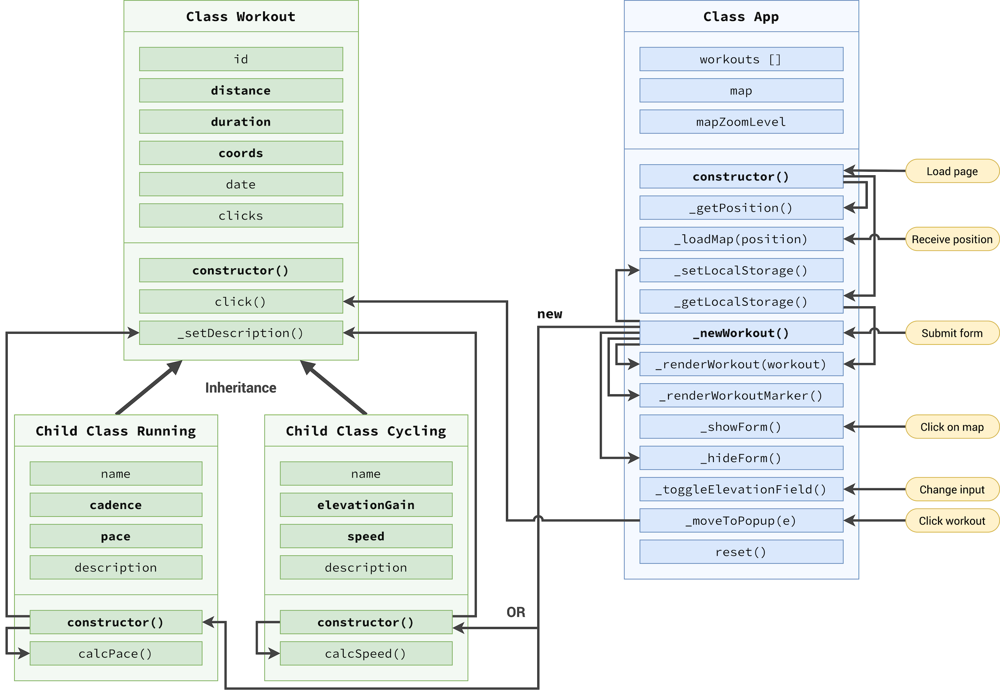
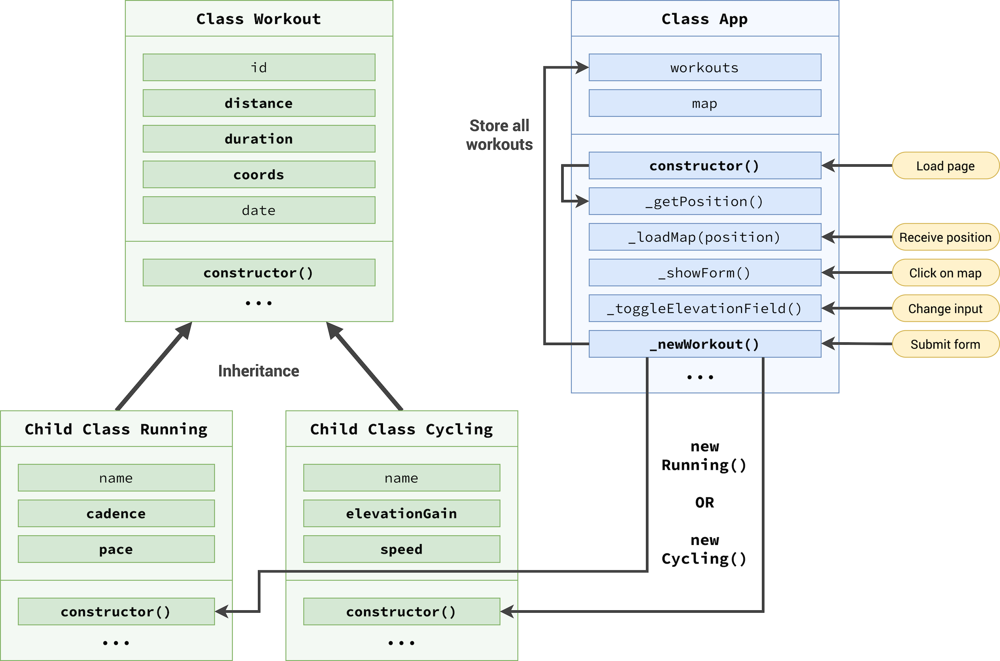
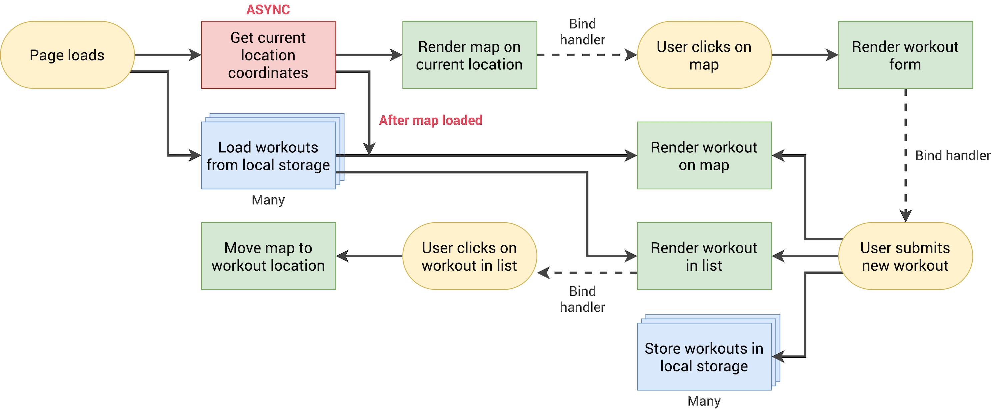

# 🗺️ Mapty – Workout Tracker

A location-based workout tracking web application built with **JavaScript, Leaflet.js, HTML, and CSS**.

Mapty allows users to record running and cycling workouts directly on an interactive map. The application uses the browser's geolocation API to determine the user's current position and stores workout data in the browser's local storage.

## 🚀 Live Demo

[View Mapty Live](https://furqaan878872.github.io/mapty-workout-tracker/)

## 📌 Features

* 📍 **User Geolocation**

  * Uses the browser's `navigator.geolocation` API to obtain the user's current location.
  * Displays an alert if location access is unavailable or denied.

* 🗺️ **Interactive Map**

  * Built using **Leaflet.js**.
  * Uses **OpenStreetMap** tiles.
  * Displays workout locations using interactive markers.

* 🏃 **Running Workouts**

  * Record running distance and duration.
  * Automatically calculates running pace.

* 🚴 **Cycling Workouts**

  * Record cycling distance, duration, and elevation gain.
  * Automatically calculates cycling speed.

* 📋 **Workout List**

  * Displays recorded workouts in an organized list.
  * Clicking a workout focuses the map on its location.

* 📌 **Map & List Interaction**

  * Clicking a workout marker highlights/focuses the corresponding workout.
  * Clicking a workout in the list moves the map to that workout location.

* 💾 **Local Storage**

  * Workout data is saved using the browser's Local Storage.
  * Previously recorded workouts can be restored when the application is reopened.

* 🔄 **Workout Form**

  * Dynamic form fields change according to the selected workout type.
  * Includes input validation for workout data.

## 🛠️ Technologies Used

* HTML5
* CSS3
* JavaScript (ES6+)
* Leaflet.js
* OpenStreetMap
* Browser Geolocation API
* Local Storage API

## 🧠 Key JavaScript Concepts Practiced

This project helped me practice and strengthen:

* Object-Oriented Programming
* Classes and Inheritance
* DOM Manipulation
* Event Handling
* Event Delegation
* Geolocation API
* Leaflet.js Map Integration
* Local Storage
* Form Handling & Validation
* Array Methods
* JavaScript Modules
* Application State Management

## 🏗️ Project Architecture

The application follows a structured architecture where user interactions, workout data, map functionality, and local storage work together.

### Architecture Diagram



### Architecture – Part 1



### Application Flowchart



## 📂 Project Structure

```text
Mapty app/
│
├── index.html
├── style.css
├── script.js
├── logo.png
├── icon.png
│
├── Mapty-architecture-final.png
├── Mapty-architecture-part-1.png
├── Mapty-flowchart.png
│
├── .gitignore
└── README.md
```

## 🎯 Purpose of the Project

The main purpose of this project was to build a practical JavaScript application while learning how multiple browser APIs and external libraries can work together in a real-world application.

It focuses on applying JavaScript concepts beyond simple exercises by building an interactive, stateful web application.

## 🔮 Future Improvements

Possible future improvements include:

* User authentication
* Backend database integration
* Cloud synchronization
* Workout editing and deletion
* Workout statistics and charts
* Responsive UI improvements
* Progressive Web App support

## 👨‍💻 Author

**Furqaan Khan**

Computer Engineering Student | Frontend Developer

GitHub: [@FURQAAN878872](https://github.com/FURQAAN878872)
